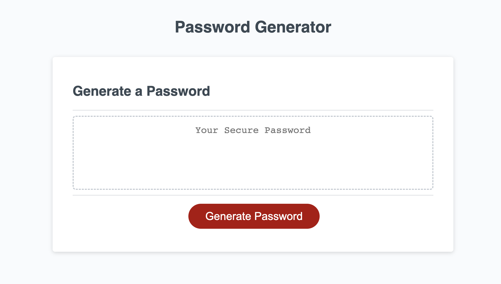

# password-generator

## Description

The goal of this project was to create a password generator application by writing JavaScript code. The JavaScript would update the HTML of the app and generate a random password based on criteria that the user selected. 

## Usage

Access my password generator at [https://gfuselier.github.io/password-generator](https://gfuselier.github.io/password-generator)

## Credits
N/A

## License
N/A